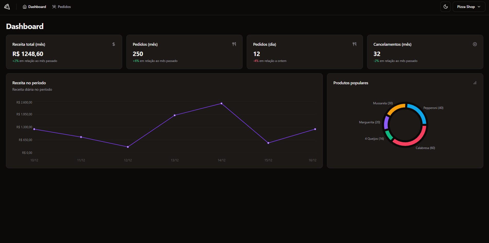

# 🍕 pizza.shop

Pizza Shop project for restaurant management and order control, iFood-style, created for study purposes.



## About

This project offers:

1. Dashboard for restaurant management and iFood-style order control.
2. Restaurant registration and login (magic link).
3. Customer registration and order creation.
4. Menu, reviews, orders, and restaurant profile management.
5. Store open/close and new order notifications.
6. Dashboard metrics: order/value charts, average reviews, and order counts.
7. Unit tests and integration with external API.

Focus on simple and easy-to-understand code.

## Tech Stack

- React
- Vite
- TypeScript
- Tailwind CSS
- shadcn/ui
- React Query
- Radix UI
- React Router DOM

## How to run

```bash
# Clone this repository
git clone https://github.com/sillasemanoel/study-pizza-shop.git

# Enter the project folder
cd study-pizza-shop

# Install dependencies
pnpm install
```

For the project to work properly, you also need to run the API, available at: https://github.com/sillasemanoel/study-pizza-shop-api

In the API repository you will find installation and startup instructions.


## Author

Sillas Emanoel
